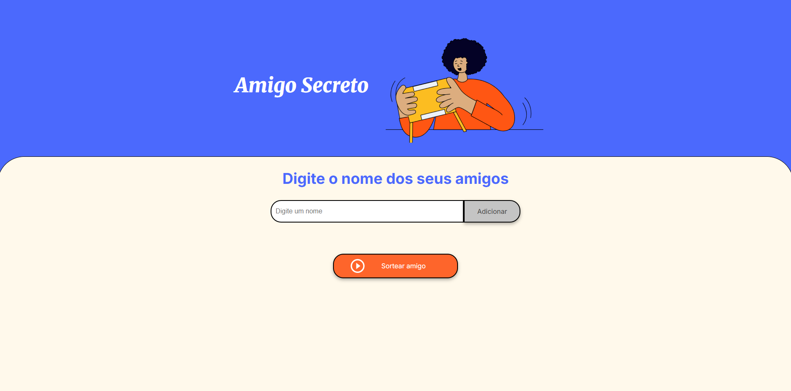

# 🎁 Amigo Secreto - Sorteador Online  

Uma aplicação web simples para sorteio de amigo secreto, desenvolvida com HTML, CSS e JavaScript puro.  

## 📌 Funcionalidades  
✅ Adicionar participantes à lista  
✅ Sortear um nome aleatório da lista  
✅ Interface responsiva e intuitiva  

## 🚀 Como Usar  
1. Clone o repositório:  
   ```bash
   git clone https://github.com/seu-usuario/amigo-secreto.git
   ```  
2. Abra o arquivo `index.html` em seu navegador.  
3. Adicione os nomes dos participantes e clique no botão para sortear.

##  Tecnologias Utilizadas
<div>
  
  
  
</div>

## 📷 Captura de Tela   

)  
